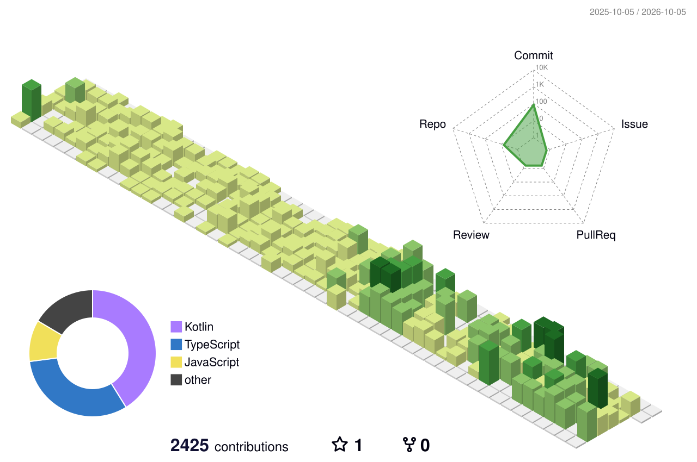

 

## 🛠 Tech Stack

**Backend** 

**Frontend** 

## 💼 Work Experience
> 회사 업무로 수행한 프로젝트입니다. (소스코드 비공개)

### 🏗 SI

- Electron 에디터 → Spring Boot REST API → React 웹 뷰어 전체 아키텍처 설계·구현
- React Three Fiber 기반 360° 파노라마 뷰어, G/A 도면 연동 내비게이션
- 360° 파노라마 위 장비 태그 배치 및 장면 간 내비게이션 편집 기능 (도메인 단위 모듈 설계)

- Three.js 기반 발전소 3D 모델(GLB) 뷰어 + 360° VR 장면 뷰어
- 발전소 → 건물 → 층 → 장면 계층 데이터 설계, 스팟 태그 에디터, 작업허가 관리
- 기존 SHE 플랫폼 연계 (작업허가서 API 연동)
- SAML2 SSO 연동, MSSQL, AWS S3

### 🏢 사내 서비스

- 기존 NicePay/CMS 결제를 토스페이먼츠로 전면 전환 (빌링키 정기구독, 단건 라이센스, 미납금/가입비 결제)
- Spring Batch 정기결제 Job: 매월 25일 영업일 보정(공휴일 API) 자동결제, 실패 재시도·만료 처리
- 인트라넷 결제 관리 대시보드 (React): 결제 실패 조회, 수동 재시도, 직권해지
- 기존 회원 결제수단 토스 빌링키 이관

## 📌 Projects

| Project | Description | Stack |
|---|---|---|
| [OAuth-Provider](https://github.com/dbrjsdn2051/OAuth-Provider) | Spring Security / OAuth2 Client 없이 OAuth 직접 구현 | Java, Spring |
| [2-Factor-Authentication](https://github.com/dbrjsdn2051/2-Factor-Authentication) | 2단계 인증/인가 | Java, Spring Security |
| [Music_Settlement](https://github.com/dbrjsdn2051/Music_Settlement) | 음원 수익 정산 배치 처리 | Java, Spring Batch |
| [payment-module-practice](https://github.com/dbrjsdn2051/payment-module-practice) | Exposed + Coroutines 결제 모듈 | Kotlin |
| [Chat-Template](https://github.com/dbrjsdn2051/Chat-Template) | Exposed + STOMP 채팅 템플릿 | Kotlin |
| [react-develop](https://github.com/dbrjsdn2051/react-develop) | Zustand, OAuth 로그인, 무한 스크롤 SNS 앱 | TypeScript, React |

## 🧩 Algorithm

## 🌿 Contributions

